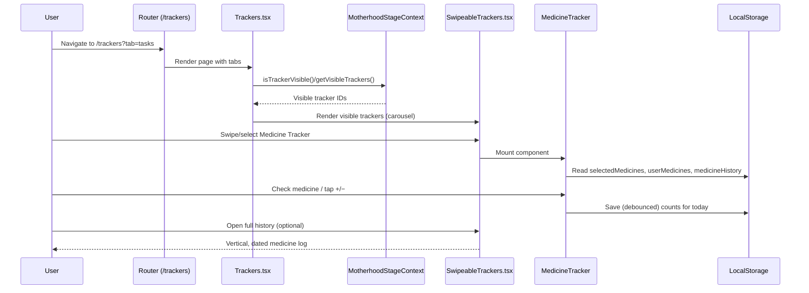

# Glow Mom Guide — App Overview and Architecture

This document explains how the app is structured, the core user flows, how features interact (for example, how the Motherhood Stage controls tracker visibility), and the technology stack used. It is intended for developers working on or integrating with the app.

## Goals

- Provide a concise mental model for the app’s modules and data flow.
- Describe how trackers are composed and how they report data back to parents screens.
- Document persistence, UI patterns, and context interactions (e.g., Motherhood Stage).

## Tech Stack

- React 18 + TypeScript, Vite build tooling
- Styling: Tailwind CSS + shadcn/ui primitives (Radix UI under the hood)
- Routing: `react-router-dom`
- State/Utilities: React Context, `date-fns`, `clsx`
- Charts: `recharts`
- Icons: `lucide-react`
- Storage: `localStorage` (no backend configured)

See `package.json` for exact versions.

## High-Level Structure

- `src/pages`
  - `Trackers.tsx`: Wellness dashboard (overview + tasks), swipeable trackers, charts, and module grid.
  - Other pages: `Library.tsx`, `Community.tsx`, `Profile.tsx`, etc.
- `src/components`
  - `SwipeableTrackers.tsx`: Contains the majority of tracker UIs and logic (Mood, Sleep, Symptoms, Medicine, Doctor Appointment, Personal Reminder, etc.). Exposes tracker configs consumed by `Trackers.tsx`.
  - Shared UI elements (cards, inputs, etc.) via shadcn/ui.
- `src/contexts`
  - `MotherhoodStageContext.tsx`: Global context for current stage and tracker/tab visibility rules.

## Core User Flow

1. User navigates to the Wellness area (`/trackers`).
2. Tabs: Overview (charts + summaries) and Tasks (swipeable trackers), controlled by `Trackers.tsx`.
3. In Tasks, a horizontally swipeable container renders a card per tracker from a config list. Trackers can be “simple” (self-contained) or “complex” (report data up via `onDataChange`).
4. The Motherhood Stage context determines which trackers and tabs are visible. This affects both the module grid and the swipeable tracker carousel.
5. Some trackers persist user inputs to `localStorage` (e.g., Medicine history), enabling recent logs and daily state restoration.

## Motherhood Stage and Tracker Visibility

- File: `src/contexts/MotherhoodStageContext.tsx`
- Stages: `Trying to Conceive`, `Incubator Stage`, `Veteran Stage`.
- Configuration: `TRACKER_VISIBILITY` maps each stage to:
  - `tabs`: which tabs are shown (e.g., `overview`, `tasks`).
  - `taskModules`: which trackers are available (IDs like `medicine-tracker`, `sleep-tracker`, etc.).
  - `pregnancyJourney`: boolean gate for journey-specific modules.
- Persistence: selected stage saved in `localStorage` under `motherhood-stage`.
- Consumption: `Trackers.tsx` calls `isTrackerVisible(tracker.id)` to filter both the grid and the swipeable trackers, effectively hiding modules for a given stage.

## Trackers Architecture

- Source of truth: `src/components/SwipeableTrackers.tsx`
- `trackerConfigs`: array defining each tracker’s
  - `id`, `title`, `subtitle`, `icon`, theme colors, completion messages.
  - `component`: React component that renders the tracker UI.
  - `isSimple`: if `true`, the component is rendered directly; otherwise it receives `onDataChange` to push data up to the parent for the Record action.
- Rendering and actions:
  - In `Trackers.tsx`, each visible tracker is rendered in a card inside the swipeable container.
  - For complex trackers, parent passes `onDataChange`, collects form state per tracker into `formDataMap`, and triggers `handleComplete` on Record.

### Medicine Tracker — Data and Interactions

- File: `src/components/SwipeableTrackers.tsx` (component: `MedicineTracker`).
- Purpose: Select medicines, log intake, and view a daily “Medicine Log”.
- Persistence keys (in `localStorage`):
  - `selectedMedicines`: array of selected medicines (name, defaultDosage, unit).
  - `userMedicines`: user-defined custom medicines.
  - `medicineHistory`: timeline of daily logs.
- History model:
  - `MedicineHistoryEntry` per day: `{ date, medicines, timestamp }`.
  - `medicines` is a counts map `{ [name]: number }`. Older entries that were arrays are normalized on read.
- UI states and flows:
  - Quick add/edit medicines with dosage & unit; supports custom entries.
  - “Medicine Log” inline card for the current or recent day with left/right navigation.
  - Full history modal (timeline by day), each day shows a vertical list; if a medicine is taken multiple times, an `xN` badge appears.
  - Quick Log Today list: check a medicine to set count=1 and use +/- buttons to adjust count. Unchecking clears the count.
- Auto-save: Changes to the daily counts are throttled and saved to `localStorage` as today’s entry.

### Other Trackers

- Mood Tracker: simple tracker recording mood; data is visualized on the Overview tab via `recharts` (lines, scatter).
- Sleep Tracker: weekly pattern chart with navigation controls.
- Symptoms Tracker: overview card (`SymptomOverview`) on Overview tab; detailed entry form inside the swipeable trackers.
- Doctor Appointment / Personal Reminder / Medical Test: complex forms using shadcn/ui inputs, persisted in-memory during session (no backend).

## Overview Tab

- File: `src/pages/Trackers.tsx` (Overview tab).
- Mood Analytics: chart area using `recharts`, with a metric selector (e.g., Overall Mood, Energy, Stress). The “Quick Insights” helper block was removed for a cleaner layout.
- Weekly Sleep Pattern: simple line chart of hours slept.
- Symptom Overview: summary component showing recent symptom entries.

## Styling and UI System

- Tailwind CSS for utility-first styling.
- shadcn/ui components built on Radix primitives for dialogs, popovers, selects, tabs, etc.
- Icons via `lucide-react`.

## Data Persistence

- `localStorage` is used for lightweight persistence:
  - `motherhood-stage` — selected stage.
  - `selectedMedicines`, `userMedicines`, `medicineHistory` — medicine module.
- There is no server; any “history” is client-side only. Consider introducing an API if multi-device sync is needed.

## Navigation and Gestures

- `react-router-dom` handles pages and query-string tabs (`/trackers?tab=overview|tasks`).
- The tracker carousel supports touch and mouse drag for navigation, with threshold-based snapping.

## Adding a New Tracker

1. Create a tracker component (simple or complex) under `src/components`.
2. Register it in `trackerConfigs` in `SwipeableTrackers.tsx` with a unique `id`.
3. If stage-specific, update `TRACKER_VISIBILITY` in `MotherhoodStageContext.tsx` to control visibility per stage.
4. For complex trackers, accept `onDataChange` and emit a minimal data object needed by the parent’s Record flow.
5. Style with Tailwind/shadcn to match existing patterns.

## Common Patterns and Conventions

- Vertical lists for history/logs with subtle dividers.
- Neutral grays for borders/backgrounds; green accent primarily indicates success/selection.
- Avoid pill clusters for history logs; prefer readable stacked rows.
- Keep component props small and focused; colocate small helper utilities where used.

## Development

- Start dev server: `npm run dev`
- Build: `npm run build` (or `npm run build:dev` for a development-mode build)
- Preview build: `npm run preview`

## Opportunities / Next Steps

- Persist non-medicine trackers to `localStorage` or a backend for parity.
- Introduce analytics for tracker usage and adherence.
- Add tests for context behavior and tracker config integrity.

## File Map (Selected)

- `src/pages/Trackers.tsx` — main Wellness experience (Overview + Tasks, swipeable trackers).
- `src/components/SwipeableTrackers.tsx` — trackers implementation and configuration; Medicine Tracker + history.
- `src/contexts/MotherhoodStageContext.tsx` — visibility rules per stage and persistence.
- `src/components/TaskTracker.tsx` — daily tasks card.
- `src/pages/Library.tsx` — Wellness content library.
- `src/pages/Profile.tsx` — profile and wellness stats.

If you’re new to the codebase, skim `SwipeableTrackers.tsx` and `Trackers.tsx` first — they anchor most of the user flows described above.

## Diagrams

### User Flow: Trackers (Tasks tab)



### Motherhood Stage → Tracker Visibility

```mermaid
flowchart TD
  A[MotherhoodStageContext currentStage] --> B{TRACKER_VISIBILITY[currentStage]}
  B -->|tabs| C[Visible Tabs]
  B -->|taskModules| D[Visible Trackers]
  B -->|pregnancyJourney| E[Pregnancy Journey Module]
  T[Trackers.tsx] --> F[Filter visibleTrackers]
  F --> G[Render carousel + grid]
```

## Key Code References

### Motherhood Stage (visibility rules)

File: `src/contexts/MotherhoodStageContext.tsx`

```ts
const TRACKER_VISIBILITY = {
  'Incubator Stage': {
    tabs: ['overview', 'tasks'],
    taskModules: ['mood-tracker', 'sleep-tracker', 'doctor-appointment', 'medicine-tracker', 'medical-test', 'personal-reminder', 'symptoms-tracker'],
    pregnancyJourney: true
  }
};

export function MotherhoodStageProvider(...) {
  const [currentStage, setCurrentStageInternal] = useState<MotherhoodStage>('Incubator Stage');

  const setCurrentStage = (stage: MotherhoodStage) => {
    setCurrentStageInternal(stage);
    localStorage.setItem('motherhood-stage', stage);
  };

  const isTrackerVisible = (trackerId: string) => {
    const config = TRACKER_VISIBILITY[currentStage];
    if (trackerId === 'pregnancy-journey') return config.pregnancyJourney;
    if (trackerId === 'tasks') return config.tabs.includes(trackerId);
    return config.taskModules.includes(trackerId);
  };
}
```

Usage in `Trackers.tsx`:

```ts
const visibleTrackers = trackerConfigs.filter(tracker => isTrackerVisible(tracker.id));
```

### Tracker configuration and rendering

Files: `src/components/SwipeableTrackers.tsx` and `src/pages/Trackers.tsx`

```ts
// SwipeableTrackers.tsx (excerpt)
const trackerConfigs = [
  { id: 'medicine-tracker', title: 'Medicine Tracker', icon: Pill, ... }
  // ...other trackers
];

// Trackers.tsx (carousel rendering)
{visibleTrackers.map((tracker) => {
  const TrackerComp = tracker.component;
  return (
    <Card>
      {/* Header */}
      <TrackerComp onDataChange={...} />
      {/* Record button for complex trackers */}
    </Card>
  );
})}
```

### Medicine Tracker data model and save flow

File: `src/components/SwipeableTrackers.tsx` (component: `MedicineTracker`)

```ts
// Counts map is the current model
const [checkedCounts, setCheckedCounts] = useState<Record<string, number>>({});

// Backward-compatible normalization (old entries used string[])
const normalizeToCounts = (meds: Record<string, number> | string[]) => {
  if (Array.isArray(meds)) {
    const counts: Record<string, number> = {};
    meds.forEach(n => { counts[n] = (counts[n] || 0) + 1; });
    return counts;
  }
  return meds || {};
};

// Debounced auto-save to localStorage as today's entry
const handleSaveMedicines = () => {
  const today = format(currentDate, 'yyyy-MM-dd');
  const newEntry = { date: today, medicines: { ...checkedCounts }, timestamp: Date.now() };
  setMedicineHistory(prev => {
    const updated = prev.filter(e => e.date !== today).concat(newEntry)
      .sort((a, b) => b.timestamp - a.timestamp)
      .slice(0, 30);
    localStorage.setItem('medicineHistory', JSON.stringify(updated));
    return updated;
  });
};

// Quick Log controls
const incrementToday = (name: string) => setCheckedCounts(p => ({ ...p, [name]: (p[name] || 0) + 1 }));
const decrementToday = (name: string) => setCheckedCounts(p => {
  const c = p[name] || 0; if (c <= 1) { const cp = { ...p }; delete cp[name]; return cp; }
  return { ...p, [name]: c - 1 };
});
```

Rendered log rows show `xN` when a medicine is taken more than once that day.

### Overview charts

File: `src/pages/Trackers.tsx`

```ts
<ComposedChart data={wellnessData}>
  <Line type="monotone" dataKey="hours" stroke="#6366f1" />
  {/* Mood Analytics with selected metric; helper block removed */}
</ComposedChart>
```

## How Pieces Align

- MotherhoodStage decides which trackers and tabs exist for a user; Trackers renders only those and the swipeable carousel mirrors that filtered set.
- Trackers passes `onDataChange` to complex tracker components; the parent owns the “Record” action while the child owns UI and validation.
- Medicine Tracker persists its own state (selection and history) to localStorage, which both the inline “Medicine Log” and the full modal consume.
- Charts on the Overview tab are view-only representations of the underlying tracker data; adding persistence to other trackers would enable richer analytics.
